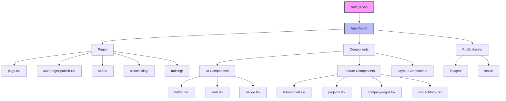
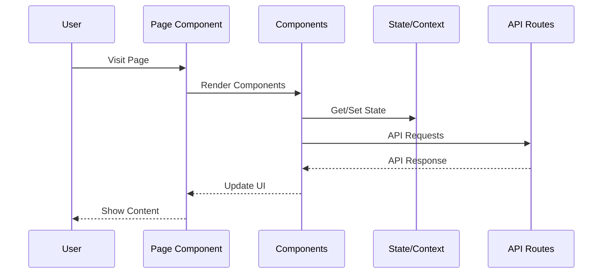
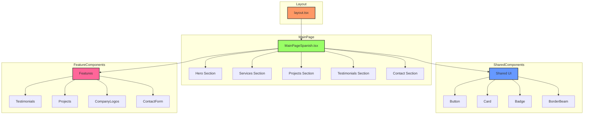
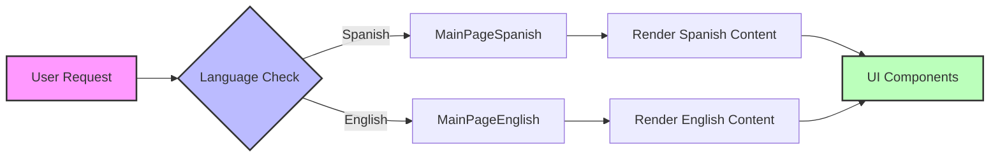
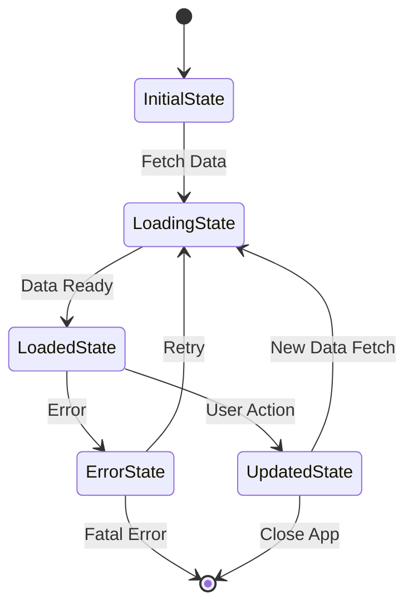

# Codebase Architecture Diagram

## Website Structure

```mermaid
graph TD
    A[Next.js App] --> B[App Router]
    B --> C[Pages]
    B --> D[Components]
    B --> E[Public Assets]

    C --> C1[page.tsx]
    C --> C2[MainPageSpanish.tsx]
    C --> C3[about/]
    C --> C4[aiconsulting/]
    C --> C5[training/]

    D --> D1[UI Components]
    D --> D2[Feature Components]
    D --> D3[Layout Components]

    D1 --> D1.1[button.tsx]
    D1 --> D1.2[card.tsx]
    D1 --> D1.3[badge.tsx]

    D2 --> D2.1[testimonials.tsx]
    D2 --> D2.2[projects.tsx]
    D2 --> D2.3[company-logos.tsx]
    D2 --> D2.4[contact-form.tsx]

    E --> E1[images/]
    E --> E2[static/]

    style A fill:#f9f,stroke:#333,stroke-width:2px
    style B fill:#bbf,stroke:#333,stroke-width:2px
```

## Data Flow

```mermaid
sequenceDiagram
    participant U as User
    participant P as Page Component
    participant C as Components
    participant S as State/Context
    participant A as API Routes

    U->>P: Visit Page
    P->>C: Render Components
    C->>S: Get/Set State
    C->>A: API Requests
    A-->>C: API Response
    C-->>P: Update UI
    P-->>U: Show Content

```

## Component Hierarchy

```mermaid
graph TD
    subgraph Layout
        L[layout.tsx]
    end

    subgraph MainPage
        MP[MainPageSpanish.tsx]
        MP --> HS[Hero Section]
        MP --> SS[Services Section]
        MP --> PS[Projects Section]
        MP --> TS[Testimonials Section]
        MP --> CS[Contact Section]
    end

    subgraph SharedComponents
        SC[Shared UI]
        SC --> BTN[Button]
        SC --> CRD[Card]
        SC --> BDG[Badge]
        SC --> BRD[BorderBeam]
    end

    subgraph FeatureComponents
        FC[Features]
        FC --> TES[Testimonials]
        FC --> PRJ[Projects]
        FC --> LOG[CompanyLogos]
        FC --> CFM[ContactForm]
    end

    L --> MP
    MP --> SC
    MP --> FC

    style L fill:#f96,stroke:#333,stroke-width:2px
    style MP fill:#9f6,stroke:#333,stroke-width:2px
    style SC fill:#69f,stroke:#333,stroke-width:2px
    style FC fill:#f69,stroke:#333,stroke-width:2px
```

## Internationalization Flow

```mermaid
flowchart LR
    A[User Request] --> B{Language Check}
    B -->|Spanish| C[MainPageSpanish]
    B -->|English| D[MainPageEnglish]
    
    C --> E[Render Spanish Content]
    D --> F[Render English Content]
    
    E --> G[UI Components]
    F --> G
    
    style A fill:#f9f,stroke:#333,stroke-width:2px
    style B fill:#bbf,stroke:#333,stroke-width:2px
    style G fill:#bfb,stroke:#333,stroke-width:2px
```

## State Management

```mermaid
stateDiagram-v2
    [*] --> InitialState
    InitialState --> LoadingState: Fetch Data
    LoadingState --> LoadedState: Data Ready
    LoadedState --> ErrorState: Error
    LoadedState --> UpdatedState: User Action
    UpdatedState --> LoadingState: New Data Fetch
    ErrorState --> LoadingState: Retry
    ErrorState --> [*]: Fatal Error
    UpdatedState --> [*]: Close App
```
